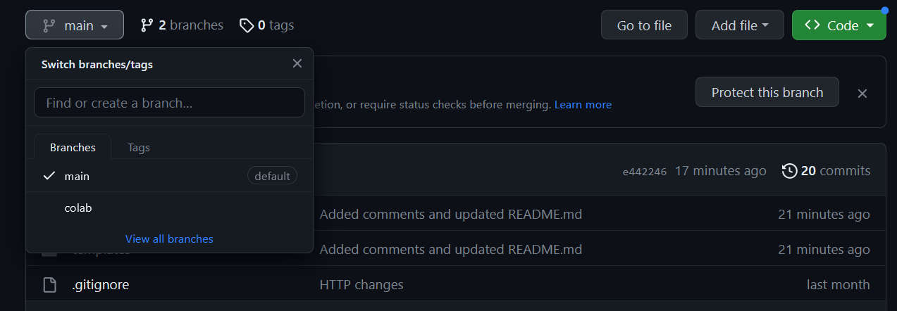
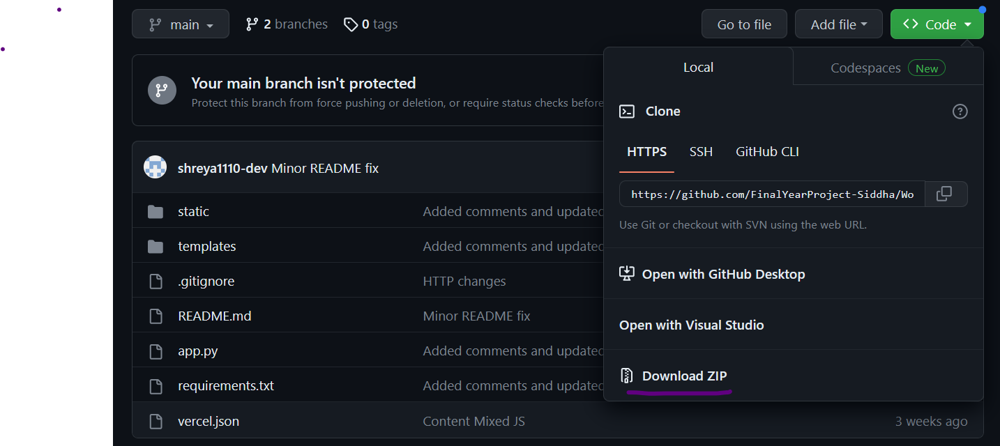

# TAMIL WORDNET FOR SIDDHA MEDICINE

## DATASET
200 மூலிகைகள்; 2001 சித்த மருத்துவக்  குறிப்புகள் - [Dataset Link](https://drive.google.com/file/d/1J5jMcgrMMK9qSGoCRxL9TBuf9xXQ5YYz/view?usp=sharing) 

## SOFTWARE REQUIREMENTS
1. Flask
2. Python
3. Other package requirements are found in **requirements.txt**.

### COLAB CODE
Branch `colab` contains colab code for OCR, Preprocessing, Sentence Annotation, Rules formulation, Category Tagging and Relationship Mapping. 
1. Navigate to colab branch as shown \

### WORDNET FLASK WEBAPP
Branch `main` contains code for the Flask app.

1. Clone the repository from the github link using \
`git clone https://github.com/FinalYearProject-Siddha/Wordnet` or download as zip as shown \

2. Navigate to the **Wordnet** folder and install required packages using \
`pip install -r requirements.txt`.

3. Run `python app.py` and open [localhost](http://localhost:5000) on any browser 

4. Alternatively, use the [Hosted Webapp](https://wordnet.vercel.app) 